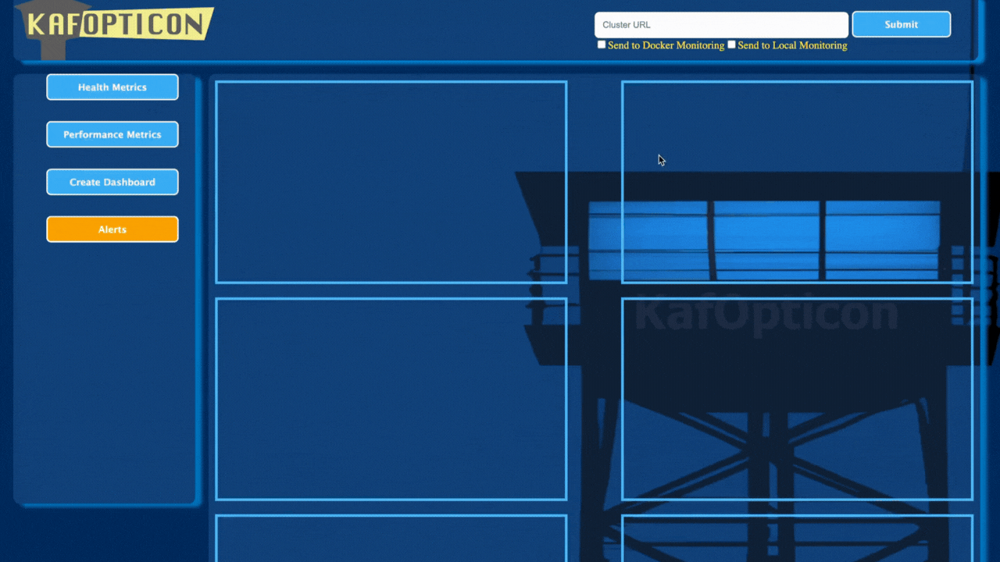
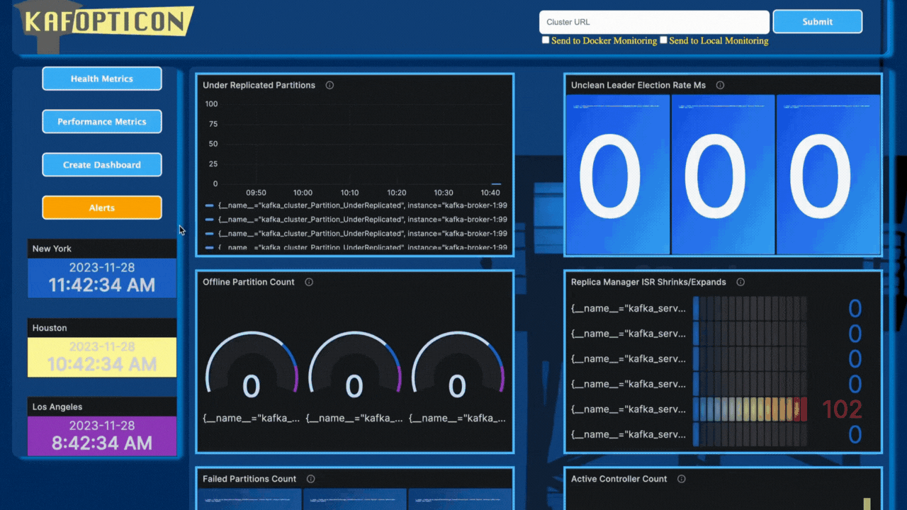
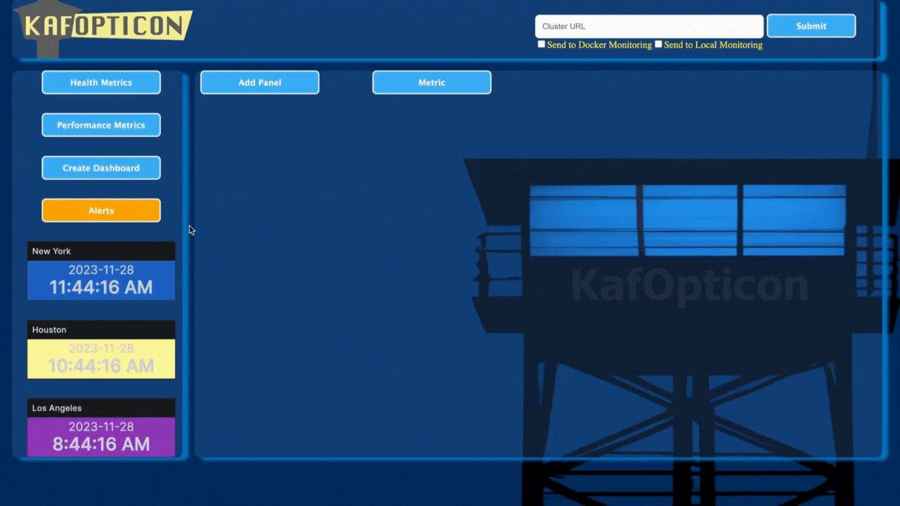

</img>

# KafOpticon

Kafka Cluster Monitor and Visualizer

# About the Project

**What:** KafOpticon is an open-source electron app used for monitoring,
visualizing, and alerting users of Kafka cluster/server metrics. Kafka is a
powerful open-source data stream processing software platform. KafOpticon
article can be found at:

**Why:** Monitoring relevant cluster metrics is challenging due to the volume
and accessibility of the metrics. KafOpticon aims to solve these problems by
providing REAL-TIME monitoring, visualization, and alert features.


**Submit JMX Port Numbers** 

Customize your own dashboard with user-selected metrics for more granular
control. 

**Customize Automatic Email Alerts**


**Dependencies:** Grafana and Prometheus

# Installation

To install as an app, navigate to the releases page of our repository, find the
file that matches your OS, and download it.

Additionally, you could clone this repository, run `npm install` and then
`npm start` to run the app from source code.

It is also possible to clone the repository, checkout into the electron-builder
branch that matches your OS, and execute `npm run dist`. The app will be in the
out/ folder at the repository's root.

# Run local test

1. Preconditions:

- Prometheus and Grafana must be installed
- Grafana must be running already (on port 3000) and must be configured to allow
  anonymous access with the admin role in the Main Org.
- Ports 9090, 3030, and 9092 must be available

2. Open up two terminals in the root directory.
3. Run `npm run bootZoo` and `npm run bootKaf1` in the separate terminals.

```javascript
npm run bootZoo
```

```javascript
npm run bootKaf1
```

4. Open up a terminal in the root directory. Run `npm start` in the root
   directory

```javascript
npm start
```

5. In the electron app, type 'localhost:2020' into the form, check 'send to
   local monitoring' and submit it. Wait. Refresh if necessary. Click into
   performance or health metrics. Data on the kafka cluster should be displayed.

## Run Docker Test

1. Preconditions:

   - Docker Desktop must be installed and the Docker daemon must be running.
   - Ports 3000, 9090, 9991, 9992, and 9993 must be available.

2. Run Kafka Test Cluster in Docker:

   - Navigate to the `docker-test` directory and run `docker-compose up -d` to
     start a Kafka cluster in Docker with three brokers, each exposing metrics
     on ports 9991, 9992,and 9993, respectively. Ensure the container is running
     without issues in Docker Desktop. Restart any exited containers if
     necessary.

   ```javascript
   docker-compose up -d

   ```

3. Run Electron:

- Run electron with `npm start` in the root directory.

```javascript
npm start
```

4. Start Monitoring:

- Provide a comma-separated list of the exposed JMX Endpoints of your Kafka
  cluster (9991, 9992, 9993 if using the provided docker-compose file), check
  the “send to Docker monitoring checkbox”, and hit send. Monitor the setup in
  Docker Desktop and refresh the app as needed using `command + r`.

5. Stop Docker Test:

- Stop the prometheus and grafana containers, and run `docker-compose down`
  within the docker-test directory.

```javascript
docker-compose down
```

# Alerts

In order to enable automatic alerts an email and app password are required. The
easiest way to do this is to provide a gmail username and an app password in the
relevant fields of the alerts dashboard. After clicking the submit button, you
must restart Grafana for the changes to take place. After Grafana has been
restarted, you are now free to add any emails you want to receive the alerts in
the Grafana alerts contact points. You can send test email using the test
button. Configure and customize threshholds for the alerts within Grafana.
Congratulations! 🏆️ You should now be able to receive automatic email alerts
about your Kafka clusters.

# Road Map

Check out [issues](https://github.com/oslabs-beta/KafOpticon/issues) for further
information about possible new features

1. Work on local route.

- Dynamically boot up Prometheus jmxExporter http server in production; in
  development, tear them down properly,
- Enable connecting to more than one kafka broker.

2. Expand the user's ability to configure the dashboard.
3. Increase testing coverage.

# Contributing

Contributions are what make the open source community a great place to If you
would like to contribute to this project take the steps below:

1. Fork the Project
2. Create a Feature Branch Use `git checkout -b newFeature`

```javascript
git checkout -b newFeature
```

3. Commit your Changes Use `git commit -m newFeature`

```javascript
git commit -m newFeature
```

4. Push to the Branch Use `git push origin newFeature`

```javascript
git push origin newFeature
```

5. Open a Pull Request

# Contributors

<br>https://github.com/anewatech <br>https://github.com/GOsorioCanales
<br>https://github.com/kelaompachai <br>https://github.com/zackweiss
